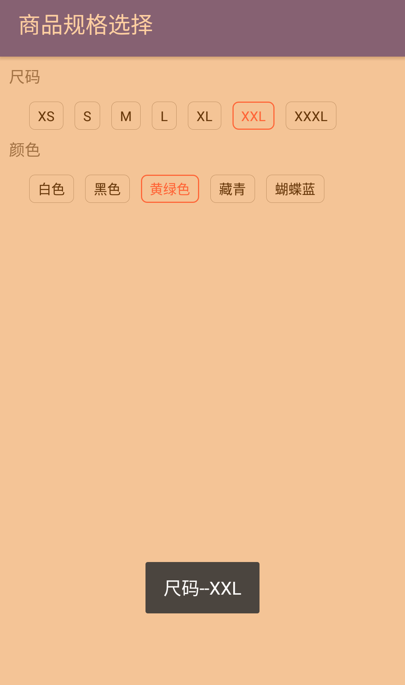

### 标签组布局及商品规格选择视图
标签组布局，可用来实现诸如热门搜索词、商品规格之类的

### 效果图

### 使用方法：
下载library模块依赖：
```groovy
    compile project(':library')
```
或者复制library模块下的三个文件到你项目里：TagViewGroup.java、GoodsSpecView.java、tag_bg_selector.xml<br />
参考app模块，示例代码如下：
```java
        TagViewGroup.UiConfig config = new TagViewGroup.UiConfig();
        config.setButtonTextColor(0xFF111111, 0xFF111111);
        config.setButtonBackgroundResource(R.drawable.hot_search_bg);
        tagViewGroup.setData(config, keywords, new TagViewGroup.OnSelectedListener() {
            @Override
            public void onSelected(String name) {

            }
        });
```
```java
        String specValues1[] = {"XS", "S", "M", "L", "XL", "XXL", "XXXL"};
        String specValues2[] = {"白色", "黑色", "黄绿色", "藏青", "蝴蝶蓝"};
        GoodsSpecView goodsSpecView = (GoodsSpecView) findViewById(R.id.goods_spec);
        List<GoodsSpecView.SpecName> specNames = new ArrayList<>();
        GoodsSpecView.SpecName specName1 = new GoodsSpecView.SpecName("尺码");
        for (String value1 : specValues1) {
            specName1.addValue(new GoodsSpecView.SpecValue(value1));
        }
        GoodsSpecView.SpecName specName2 = new GoodsSpecView.SpecName("颜色");
        for (String value2 : specValues2) {
            specName2.addValue(new GoodsSpecView.SpecValue(value2));
        }
        specNames.add(specName1);
        specNames.add(specName2);
        goodsSpecView.setData(specNames, new GoodsSpecView.OnSelectedListener() {
            @Override
            public <N, V> void onSelected(N specName, V specValue) {
            }
        });

```
商品规格支持JavaBean，实现ISpecName和ISpecValue接口即可，如：
```java
     public class SpecsBean implements GoodsSpecView.ISpecName {
            private String id;
            private String storeid;
            private String goodsid;
            private String title;
            private List<ItemsBean> items;

            public String getId() {
                return id;
            }

            public void setId(String id) {
                this.id = id;
            }

            public String getStoreid() {
                return storeid;
            }

            public void setStoreid(String storeid) {
                this.storeid = storeid;
            }

            public String getGoodsid() {
                return goodsid;
            }

            public void setGoodsid(String goodsid) {
                this.goodsid = goodsid;
            }

            public String getTitle() {
                return title;
            }

            public void setTitle(String title) {
                this.title = title;
            }

            public List<ItemsBean> getItems() {
                return items;
            }

            public void setItems(List<ItemsBean> items) {
                this.items = items;
            }

            @Override
            public String getName() {
                return title;
            }

            @Override
            public List<ItemsBean> getValues() {
                return items;
            }

            @Override
            public String toString() {
                return title;
            }

        }

       public class ItemsBean implements GoodsSpecView.ISpecValue {
            private String id;
            private String specid;
            private String title;
            private String thumb;

            public String getId() {
                return id;
            }

            public void setId(String id) {
                this.id = id;
            }

            public String getSpecid() {
                return specid;
            }

            public void setSpecid(String specid) {
                this.specid = specid;
            }

            public String getTitle() {
                return title;
            }

            public void setTitle(String title) {
                this.title = title;
            }

            public String getThumb() {
                return thumb;
            }

            public void setThumb(String thumb) {
                this.thumb = thumb;
            }

            @Override
            public String getName() {
                return title;
            }

            @Override
            public String toString() {
                return title;
            }

        }

        List<SpecsBean> specsBeanList = dataBean.getSpecs();
        goodsSpecView.setData(specsBeanList, new GoodsSpecView.OnSelectedListener() {
            @Override
            public <N, V> void onSelected(N specName, V specValue) {
                onSpecificationClicked(ItemsBean) specValue);
            }
        });
```